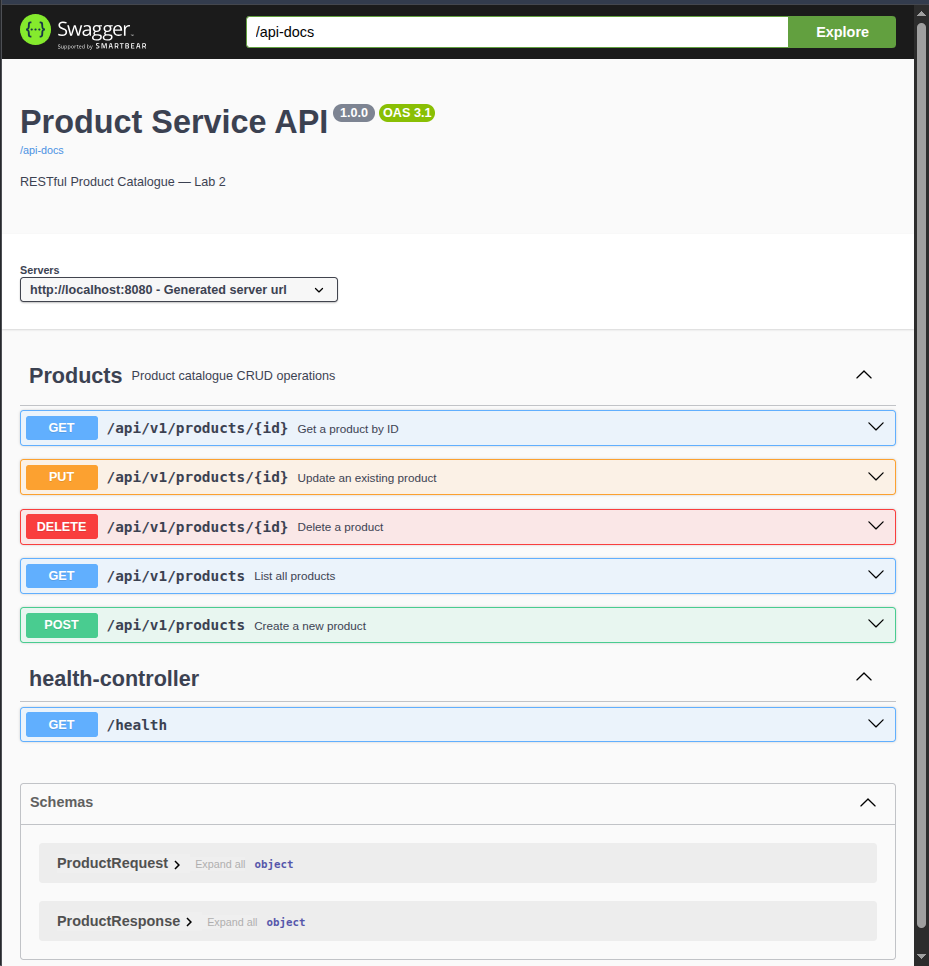
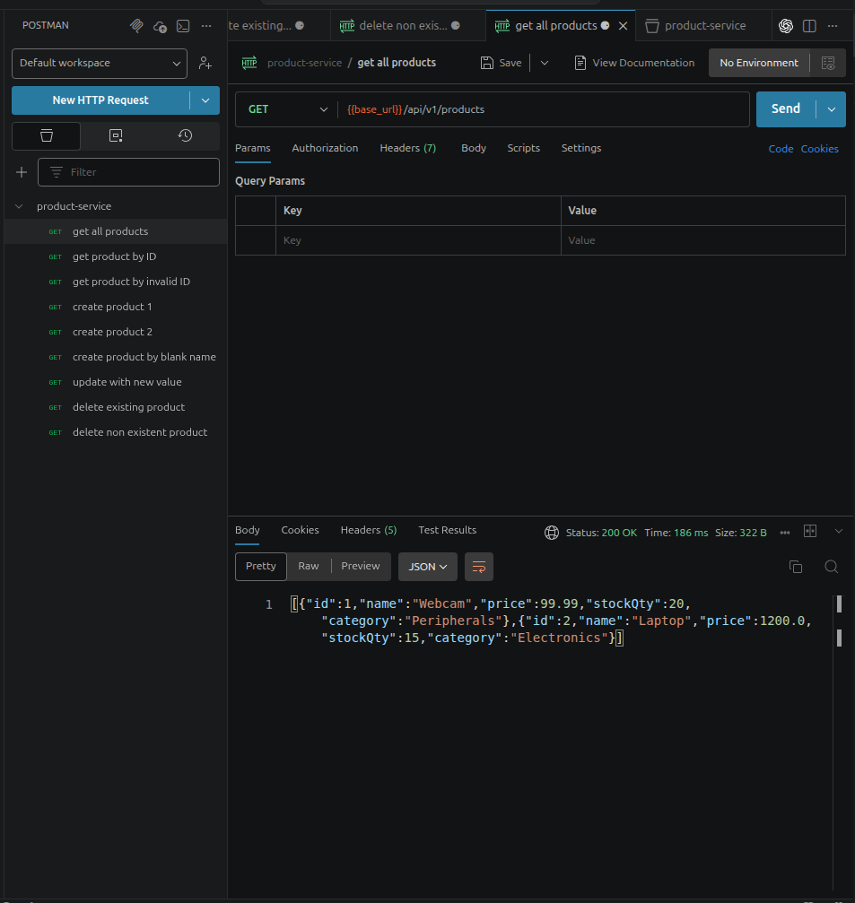
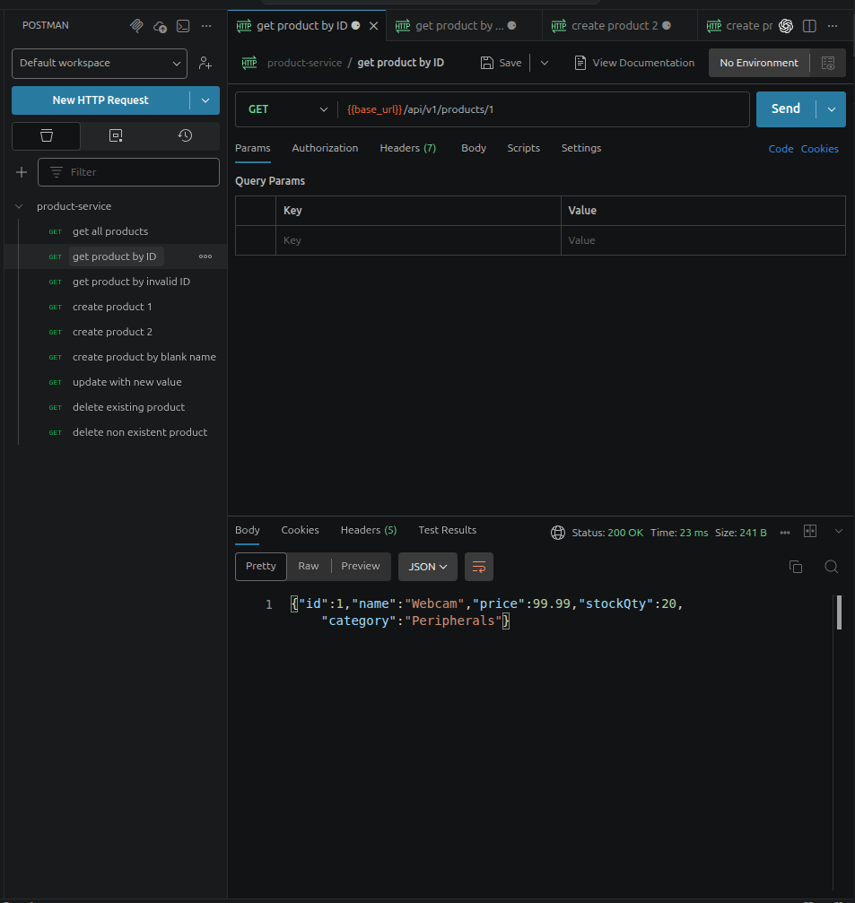
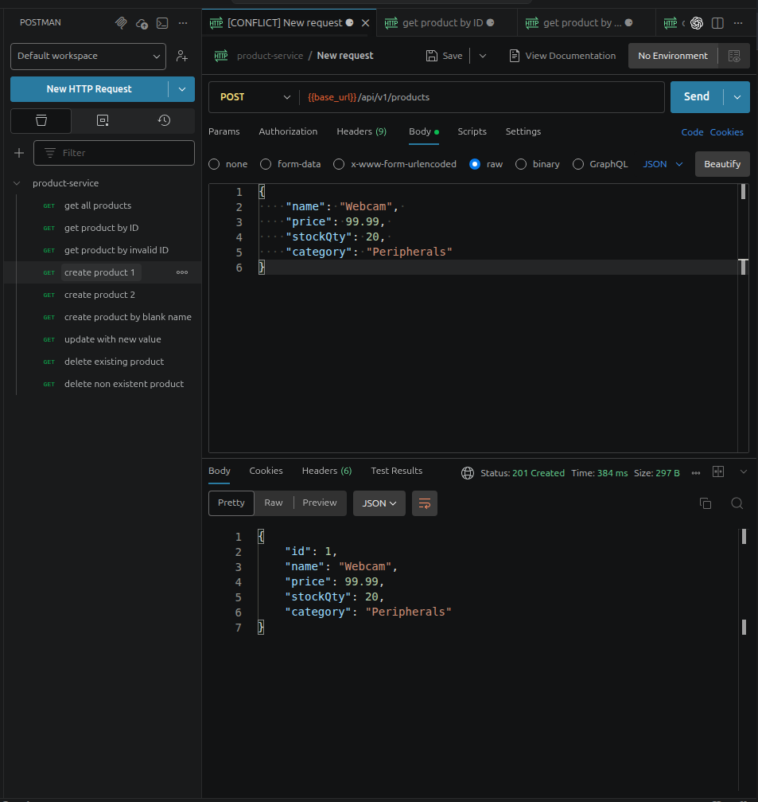
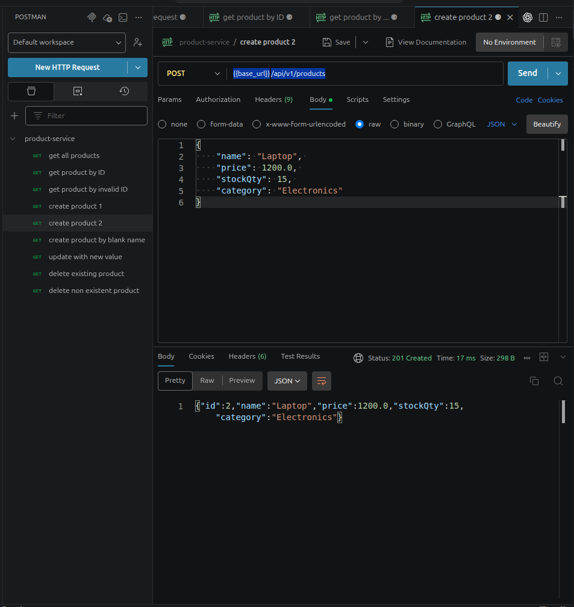
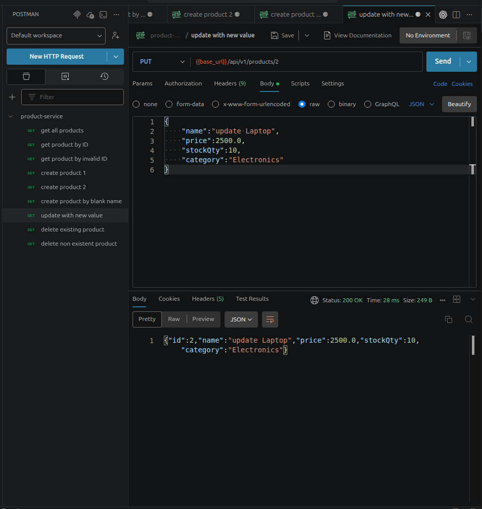
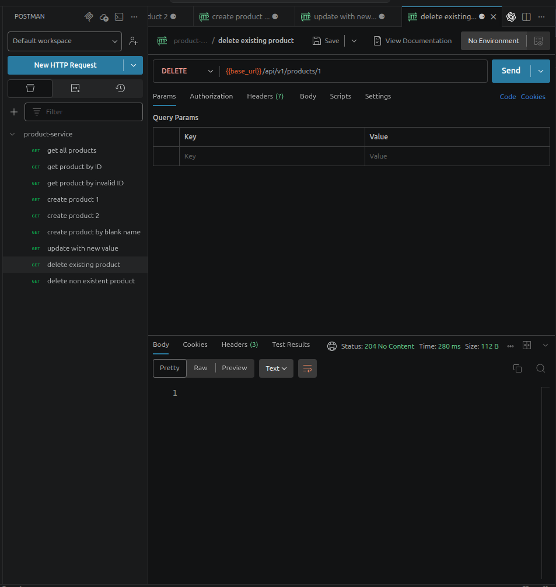
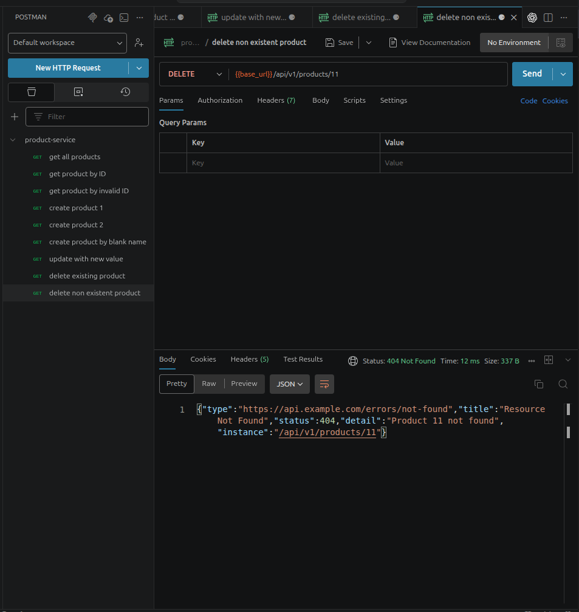
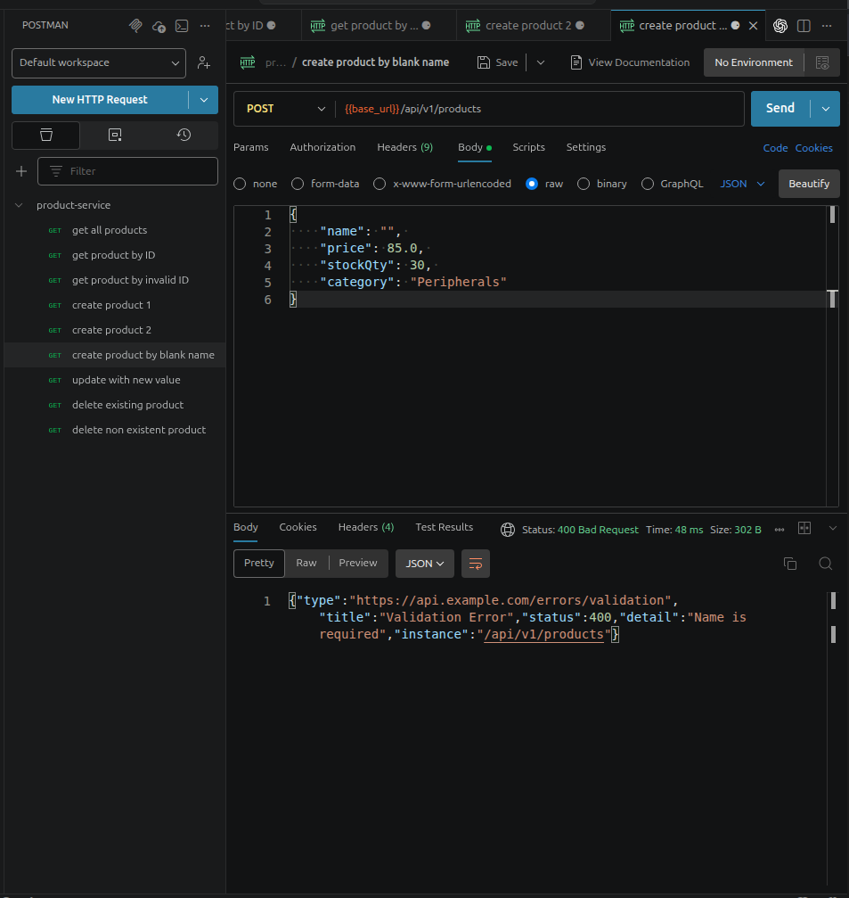

# Product Service API (Spring Boot)

## Overview

This project is a **Spring Boot RESTful API** for managing a product catalogue.
It was developed as part of **Enterprise Application Development Lab 2**.

The application demonstrates a production-style architecture with:

* Full **CRUD operations**
* **DTO pattern (ProductRequest / ProductResponse)**
* **Validation using Bean Validation**
* **Global exception handling with ProblemDetail (RFC 9457)**
* **Swagger/OpenAPI documentation**
* **MockMvc integration testing**
* **CI pipeline with GitHub Actions**

---

## Technologies Used

* Java 21
* Spring Boot 3.x
* Spring Web
* Spring Data JPA
* H2 Database (in-memory)
* Maven
* Springdoc OpenAPI (Swagger UI)
* JUnit 5 & MockMvc

---

## Project Structure

```
src/main/java/com/ctbe/productservice
 ├── controller        # REST Controllers
 ├── service           # Business logic layer
 ├── repository        # Data access layer
 ├── model             # JPA entities
 ├── dto               # Request/Response DTOs
 └── exception         # Global exception handling
```

---

## API Base URL

```
http://localhost:8080/api/v1/products
```

---

## API Endpoints

### 1. Get all products

```
GET /api/v1/products
```

Response: `200 OK`

---

### 2. Get product by ID

```
GET /api/v1/products/{ID}
```

* `200 OK` → if found
* `404 Not Found` → if not found

---

### 3. Create a product

```
POST /api/v1/products
```

Request body:

```json
{
  "name": "Webcam",
  "price": 99.99,
  "stockQty": 20,
  "category": "Peripherals"
}
```

Response:

* `201 Created`
* Includes `Location` header

---

### 4. Update a product

```
PUT /api/v1/products/{id}
```

Request body:

```json
{
  "name": "Updated Webcam",
  "price": 120.0,
  "stockQty": 10,
  "category": "Peripherals"
}
```

Response:

* `200 OK`
* `404 Not Found` if product does not exist

---

### 5. Delete a product

```
DELETE /api/v1/products/{id}
```

Response:

* `204 No Content`
* `404 Not Found` if product does not exist

---

## Validation Rules

Validation is applied on **ProductRequest DTO**:

* `name` → required (`@NotBlank`)
* `price` → must be > 0 (`@DecimalMin`)
* `stockQty` → must be ≥ 0 (`@Min`)
* `category` → required (`@NotBlank`)

---

## Error Handling (ProblemDetail - RFC 9457)

### Example: 404 Not Found

```json
{
  "type": "https://api.example.com/errors/not-found",
  "title": "Resource Not Found",
  "status": 404,
  "detail": "Product 99 not found"
}
```

---

### Example: 400 Validation Error

```json
{
  "type": "https://api.example.com/errors/validation",
  "title": "Validation Error",
  "status": 400,
  "detail": "Name is required"
}
```

---

## Swagger / OpenAPI Documentation

### Access Swagger UI:

```
http://localhost:8080/swagger-ui.html
```


### OpenAPI JSON:

```
http://localhost:8080/api-docs
```

Swagger provides:

* Interactive API testing
* Endpoint documentation
* Request/response schemas

---

## Running the Application

### 1. Clone the repository

```
git clone https://github.com/simon2130/product-service.git
```

### 2. Navigate to project

```
cd product-service
```

### 3. Run application

```
mvn spring-boot:run
```

---

## Testing

### Run all tests

```
mvn test
```

### Expected output:

```
BUILD SUCCESS
Tests run: 12, Failures: 0
```

---

### Test Coverage (MockMvc)

Tests include:

* GET all products → 200

* GET by ID → 200 / 404


* POST → 201 / 400


* PUT → 200

* DELETE → 204 / 404


* Validation errors → 400

---

## Postman Collection

A Postman collection is included:

```
postman/product-service-lab2.json
```

You can import it into Postman to test all endpoints quickly.

---

## Database

* Uses **H2 in-memory database**
* Data resets on application restart

H2 Console:

```
http://localhost:8080/h2-console
```

---

## CI Pipeline (GitHub Actions)

* Runs on every push
* Builds project
* Executes all tests
* Uploads test reports

Badge at top of README shows build status.

---

## Key Concepts Implemented

* RESTful API design
* DTO pattern
* Bean Validation
* Global exception handling
* Swagger documentation
* Integration testing with MockMvc
* CI/CD with GitHub Actions

---

## Author

Simon Mesfin
ATE/7211/14

---

## Lab Context

This project is based on:

**Enterprise Application Development — Lab 2**
RESTful Product Catalogue API

Features implemented:

* Full CRUD operations
* DTO pattern
* Validation
* ProblemDetail error responses
* Swagger documentation
* MockMvc integration tests
* CI pipeline

---
